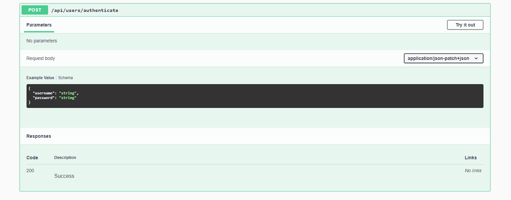
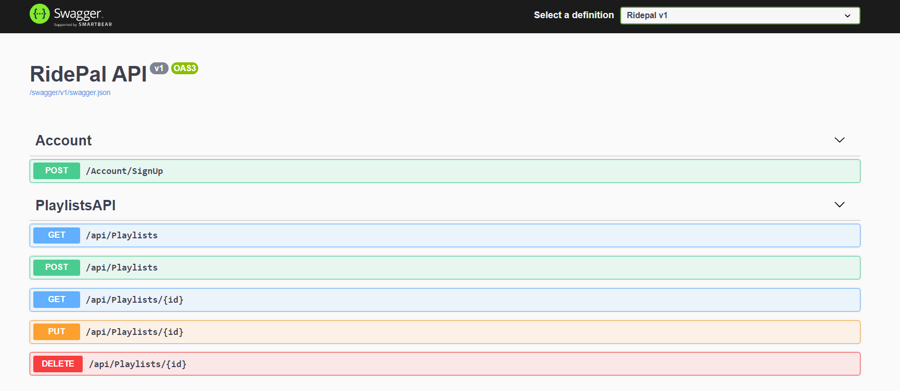
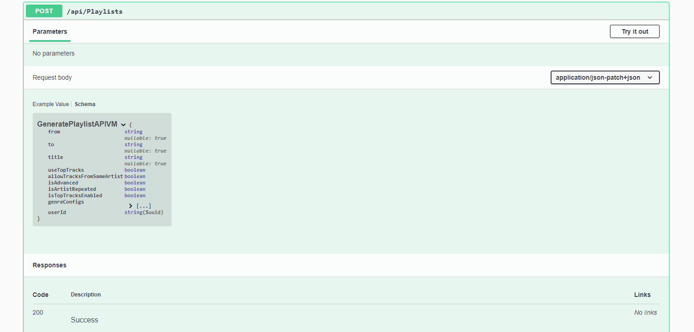
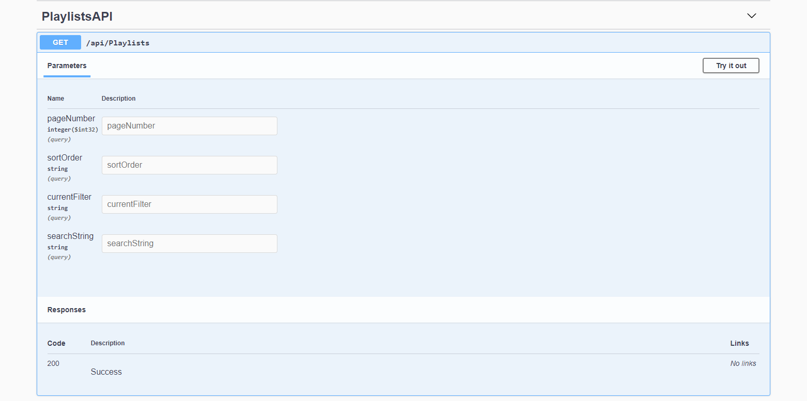
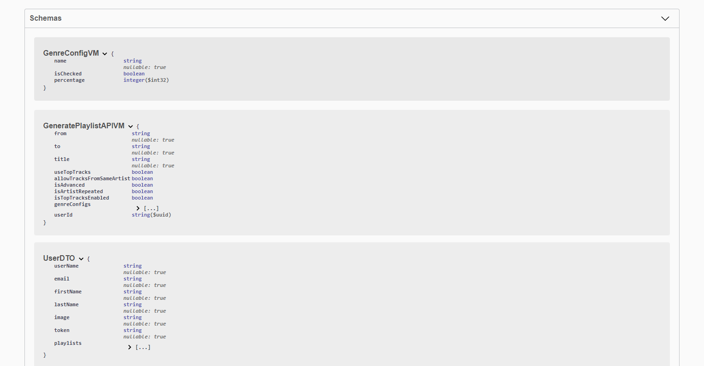
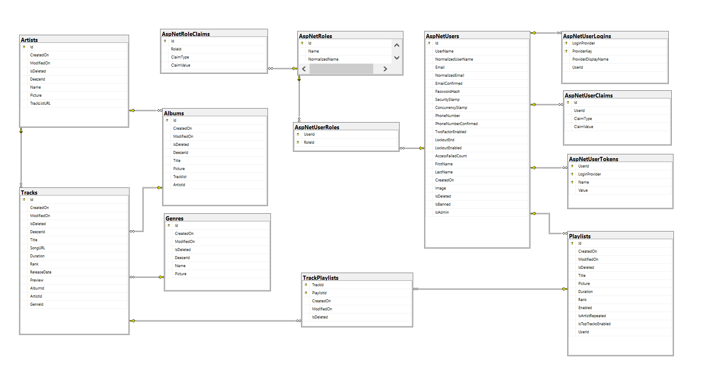

# RidePal

Link to our [Trello Board](https://trello.com/b/U9rztCjA)!

The API functionality is implemented inside the .NET Core 3.1 MVC Web Application.

The API services are available for registered and  authenticated users only.

To create an account please go to: [SignUp Page](https://localhost:5001/Account/SignUp)

To authenticate send post request to 
"https://localhost:5001/api/users/authenticate" 
with you username and password in the body:

Technologies:

Microsoft.AspNetCore.Identity.EntityFrameworkCore (3.1.9)
Microsoft.EntityFrameworkCore.SqlServer (3.1.9)
Microsoft.EntityFrameworkCore.Tools (3.1.9)
Microsoft.EntityFrameworkCore.InMemory (3.1.9)
Swashbuckle.AspNetCore.SwaggerGen (5.6.3)
Swashbuckle.AspNetCore.SwaggerUI (5.6.3)
AutoMapper (10.1.1)
Moq (4.15.1)

RidePal uses the following API Services:

[Deezer (API)](https://developers.deezer.com/)

[Bing Maps (API)](https://www.microsoft.com/en-us/maps/documentation)

RidePal includes 5 projects:
RidePal.Data
RidePal.Models
RidePal.Tests
RidePal.Services
RidePal.Web

A screenshot of the API Documentation

Here is how to Generate a Playlist:

 

Here is how to get filtered results of the Playlists:

A screenshot of the Schemas

Database / Class Diagrams

